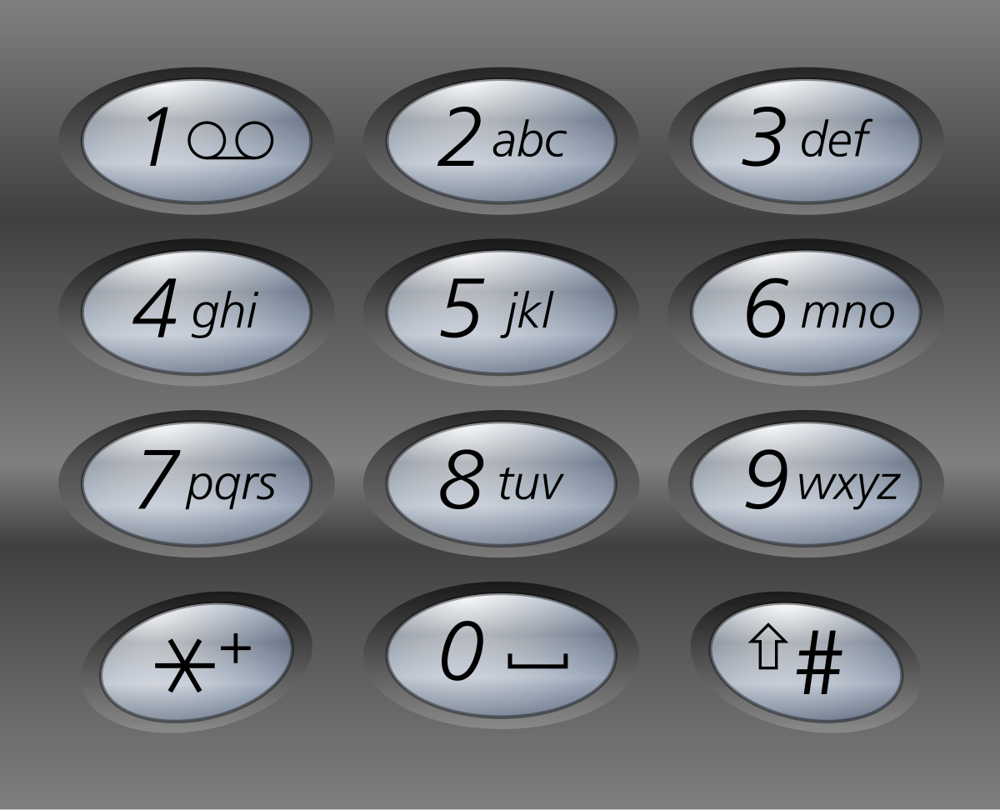
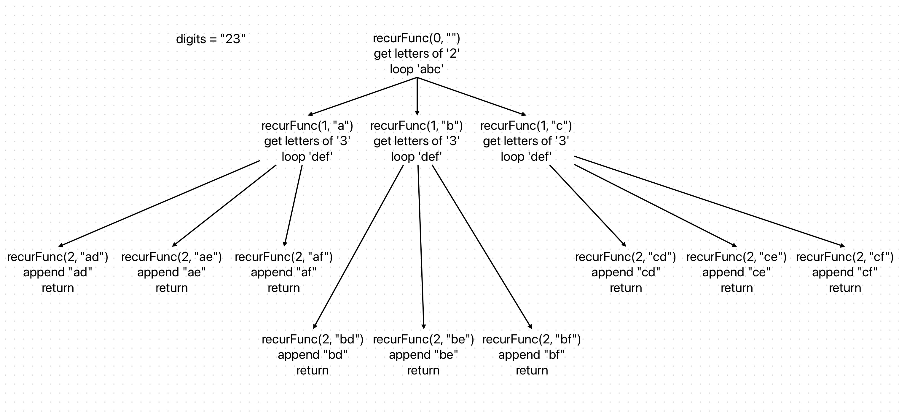

# Phone Number Letter Combinations in Go

Given a string containing digits from 2-9 inclusive, return all possible letter combinations that the number could represent. Return the answer in any order.



## Examples

```go
letterCombinations("23")
output = ["ad","ae","af","bd","be","bf","cd","ce","cf"]

letterCombinations("")
output = []

letterCombinations("2")
output = ["a","b","c"]

letterCombinations("27")
output = ["ap","aq","ar","as","bp","bq","br","bs","cp","cq","cr","cs"]

letterCombinations("234")
output = [
    "adg","adh","adi","aeg","aeh","aei","afg","afh","afi",
    "bdg","bdh","bdi","beg","beh","bei","bfg","bfh","bfi",
    "cdg","cdh","cdi","ceg","ceh","cei","cfg","cfh","cfi"
]

letterCombinations("79")
output = [ "pw","px","py","pz","qw","qx","qy","qz", "rw","rx","ry","rz", "sw","sx","sy","sz"]
```

## Explaination

Given input is "23", we use recursive(backtracking) approach.



### Time complexity: O(k^n × n)

n = number of digits in the input string ("23" = 2)

k = average number of letters per digit (≈ 3 to 4)

Then, for each digit, you branch into k possibilities.
So total combinations = k^n.
